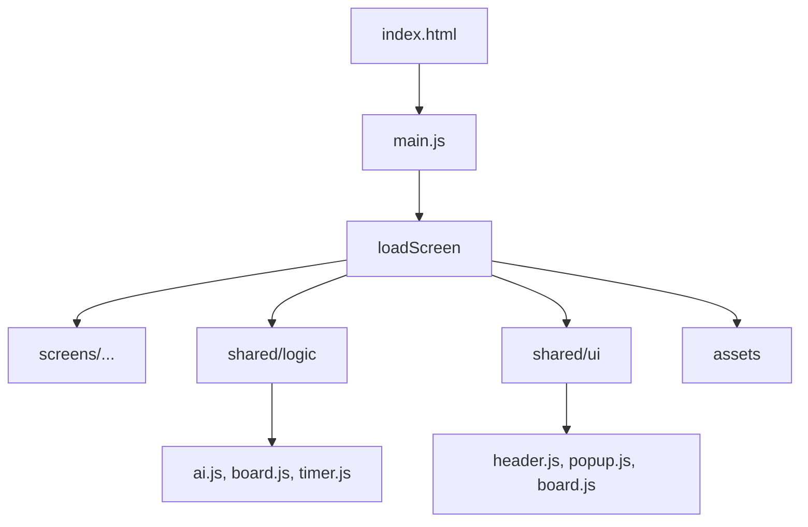

# Đồ án cuối kỳ – Môn Kỹ năng Nghề Nghiệp [SS004.10]

## Thông tin nhóm

- **Tên nhóm**: Nhóm số 11 (ACE Team)
- **Số thành viên**: 5
- **Công nghệ sử dụng**: HTML, CSS, JavaScript (DOM, Animation)
- **Công cụ hỗ trợ làm việc nhóm**:
  - Quản lý công việc: [Github Projects](https://github.com/orgs/ace-team-uit/projects/1)
  - Giao tiếp nhóm: [Slack channel](https://ss004e31.slack.com/archives/C098L65A0Q5) hoặc Discord (nội bộ)
  - Biên bản họp: [Meeting minutes](https://ss004e31.slack.com/archives/C098L65A0Q5)
  - Viết báo cáo: [Overleaf (LaTeX)](https://www.overleaf.com/read/yvjnrzvvnfxr#a8c167)
  - Slide báo cáo: [Overleaf (LaTeX)](https://www.overleaf.com/read/jdcrfzfxmjbx#dd4c8b)
  - Lưu trữ mã nguồn: [GitHub repo](https://github.com/ace-team-uit/SS004.10_FinalProject_TicTacToe)

## Thành viên nhóm

| Họ và tên         | MSSV     | GitHub cá nhân                                                        |
| ----------------- | -------- | --------------------------------------------------------------------- |
| Đặng Chí Thanh    | 25730067 | [uit-25730067-chithanh](https://github.com/uit-25730067-chithanh)     |
| Đào Vĩnh Bảo Phúc | 25730053 | [uit-25730053-baophuc](https://github.com/uit-25730053-baophuc)       |
| Phạm Lê Yến Nhi   | 25730049 | [uit-25730049-yennhi](https://github.com/uit-25730049-yennhi)         |
| Tăng Phước Thịnh  | 25730071 | [uit-25730071-phuocthinh](https://github.com/uit-25730071-phuocthinh) |
| Hoàng Cao Sơn     | 25730061 | [uit-25730061-caoson](https://github.com/uit-25730061-caoson)         |

## Giảng viên hướng dẫn

- **Họ tên**: Nguyễn Văn Toàn
- **Mã cán bộ**: UIT.19529999
- **Email**: toannv@uit.edu.vn
- **GitHub**: [toannv-uit](https://github.com/toannv-uit)

## Tên dự án

Trò chơi Cờ Caro – Tic Tac Toe (phiên bản Web)

## Giới thiệu

Đây là sản phẩm của đồ án cuối kỳ môn học Kỹ năng Nghề Nghiệp [SS004.10] - Dự án Tic Tac Toe (Caro) được phát triển bởi **ACE Team** với ba mục tiêu cốt lõi:

- **Trải nghiệm AI thông minh**: Sử dụng thuật toán Minimax và tối ưu hóa Alpha-Beta pruning, đem lại đối thủ máy đầy thử thách.
- **Giao diện thân thiện**: UI trực quan, hiện đại, dễ sử dụng, tương thích nhiều thiết bị.
- **Kiến trúc bền vững**: Module hóa rõ ràng, tách biệt logic và giao diện, dễ dàng mở rộng và bảo trì.

### Tính năng chính

- **Chế độ chơi**: Người vs Máy với "AI" thông minh
- **Kích thước lưới**: 3x3, 4x4, 5x5 với luật thắng tương ứng
- **Hệ thống điểm**: Thắng 2/3 trận để chiến thắng chung cuộc
- **Tùy chỉnh**: Âm thanh, theme, độ khó AI
- **Giao diện**: Hiện đại, responsive, animation mượt mà

## Hướng dẫn sử dụng

### Chạy game

1. Mở tệp `index.html` bằng trình duyệt web hiện đại (Chrome, Firefox,...).
2. Xem phần giới thiệu, chọn chế độ chơi trong màn hình Select.
3. Tuỳ chỉnh Theme, Challenge Mode, Âm thanh trong Settings.
4. Chọn kiểu lưới (3x3, 4x4, 5x5), bắt đầu trò chơi.
5. Mỗi lượt có giới hạn thời gian. Người chơi thắng 2/3 trận sẽ thắng chung cuộc.
6. Có thể chọn chơi lại hoặc quay về màn hình chính sau mỗi ván.

### Test Audio System

Để test hệ thống âm thanh, mở file `demo-audio.html`:

- Test các sound effects (click, win, lose, draw)
- Test BGM với fade effect
- Điều chỉnh volume và mute
- Chạy unit tests
- Xem console logs và status

### Test Game Mode 1, 2 & Game Page

Để test Game Mode 1 page, mở file `screens/mode1/mode1.html` trực tiếp:

- Test UI layout và image buttons
- Test các hình ảnh chọn độ khó (Easy, Medium, Hard)
- Test nút back và navigation
- Test hover effects với scale transform
- Xem console logs và interactions

Để test Game Mode 2 page, mở file `screens/mode2/mode2.html` trực tiếp:

- Test UI layout và grid size buttons
- Test các hình ảnh chọn kích thước lưới (3x3, 4x4, 5x5)
- Test nút back và navigation
- Test hover effects với scale transform
- Xem console logs và interactions

Để test Game Page, mở file `screens/game/game.html` trực tiếp:

- Test UI layout với player profiles và game board
- Test interactive board cells (click để đánh X/O)
- Test control buttons (music, reset, settings)
- Test dynamic grid size (3x3, 4x4, 5x5)
- Xem console logs và interactions

### Test HUD Component

Để test HUD component độc lập, mở file `demo-hud.html`:

- Test tất cả các function của HUD: updateScores, updateTimer, updateStars
- Test color palette và theme preview
- Test keyboard shortcuts (ESC, M, S, R)
- Test visual effects và animations
- Chạy unit tests để kiểm tra logic
- Xem console logs và test results

Để chạy unit tests, mở file `tests/hud.test.js` hoặc sử dụng `runAllTests()` trong console.

## Kiến trúc tổng thể

Hệ thống dự án được xây dựng theo mô hình tách biệt:

- **Logic (shared/logic)**: Xử lý toàn bộ nghiệp vụ game
- **UI (shared/ui)**: Các component giao diện tái sử dụng
- **Screens (screens/)**: Tổ chức thành từng màn hình riêng biệt

### Cấu trúc thư mục

```
├── assets/       # Font, hình ảnh, âm thanh
│   ├── fonts/
│   ├── images/
│   ├── sounds/
│   └── video/
│
├── docs/         # Tài liệu dự án
│   └── appendix/
│       └── test-cases/
│           ├── acess-audio-popup.png
│           ├── exit-popup.png
│           ├── loading-popup.png
│           └── win-popup.png
│       └── console/ (với các console logs phát triển)
│       └── perf-logs/ (với báo cáo hiệu năng)
│
│       ├── architecture.md
│       ├── changelog.md
│       └── setup-guide.md
│
├── screens/      # Các màn hình chính
│   ├── intro/    # Logo + hiệu ứng giới thiệu
│   ├── home/     # Trang chính, bắt đầu chơi
│   ├── mode1/    # Chọn chế độ chơi: Người vs Người
│   ├── mode2/    # Chọn chế độ chơi: Người vs Máy
│   ├── select/   # Tuỳ chỉnh: kích thước bàn cờ, độ khó, skin
│   ├── game/     # Trận đấu diễn ra
│   ├── result/   # Hiển thị kết quả, tùy chọn chơi lại
│   ├── settings/ # Cài đặt âm thanh, theme, ngôn ngữ
│   └── marketplace/ # Cửa hàng skin/nhân vật (dự kiến)
│
├── shared/
│   ├── logic/    # Logic game
│   │   ├── board.js      # Quản lý trạng thái bàn cờ
│   │   ├── ai.js         # Thuật toán Minimax + Alpha-Beta
│   │   ├── rounds.js     # Quản lý vòng đấu, điểm số
│   │   ├── timer.js      # Xử lý đếm giờ từng lượt
│   │   └── navigation.js # Điều phối chuyển đổi màn hình
│   ├── ui/       # Component UI
│   │   ├── header.js     # Hiển thị tên người chơi, điểm số, timer
│   │   ├── board.js      # Render bàn cờ, xử lý click
│   │   └── popup.js      # Thông báo kết quả, cài đặt, loading
│   └── utils/    # Module phụ trợ
│       ├── storage.js    # Tương tác với localStorage
│       └── audio.js      # Quản lý phát nhạc nền, hiệu ứng
│
├── styles/       # CSS chung toàn game
│   ├── global.css
│   ├── variables.css
│   ├── reset.css
│   ├── utilities.css
│   ├── components.css
│   └── themes.css
│
├── index.html    # Entry point
├── main.js       # Khởi tạo & điều phối game
├── .gitignore
├── CONTRIBUTING.md
├── LICENSE
└── README.md
```

## Luồng hoạt động chính



### Flow Navigation Game

1. **Intro** → Logo + hiệu ứng giới thiệu
2. **Home** → Trang chính, bắt đầu chơi
3. **Mode Select (mode1/mode2)** → Chọn chế độ chơi: Người vs Người hoặc Người vs Máy
4. **Select** → Tuỳ chỉnh: kích thước bàn cờ, độ khó, skin
5. **Game** → Trận đấu diễn ra
6. **Result** → Hiển thị kết quả, tùy chọn chơi lại hoặc về Home

## Mô tả chi tiết các module

### shared/logic – Lõi game & thuật toán

- **board.js (BoardManager)**
  - Quản lý trạng thái bàn cờ, nước đi, kiểm tra thắng/thua/hòa
  - Lưu state dưới dạng mảng 1 chiều để tối ưu duyệt
  - Phương thức: `initState()`, `makeMove()`, `checkWinner()`, `resetForNewRound()`
  - Luật thắng:
    - 3×3: 3 liên tiếp
    - 4×4/5×5: 4 liên tiếp, không bị chặn 2 đầu
    - 5×5: 5 liên tiếp, cho phép chặn 1 đầu

- **ai.js (TTT_AI)**
  - Sử dụng **Minimax** + **Alpha-Beta pruning**
  - Có heuristic đánh giá thế cờ: dựa trên chuỗi liên tiếp của 2 bên
  - Hỗ trợ nhiều độ khó (Easy, Medium, Hard)
  - Phương thức: `getAIMove()`, `findBestMove()`, `evaluateBoard()`

- **rounds.js**: Quản lý vòng đấu, điểm số, xác định ai đi trước
- **timer.js**: Xử lý đếm giờ từng lượt, hỗ trợ pause/resume
- **navigation.js**: Điều phối chuyển đổi màn hình, trạng thái app

### shared/ui – Thành phần giao diện

- **header.js**: Hiển thị tên người chơi, điểm số, timer
- **board.js**: Render bàn cờ dựa vào dữ liệu từ `board.js` logic, xử lý click
- **popup.js**: Thông báo kết quả, cài đặt, loading

### screens – Các màn hình

- **Intro**: Logo, hiệu ứng mở đầu
- **Home**: Menu chính, nút bắt đầu
- **Mode1/Mode2**: Chọn chế độ chơi
- **Select**: Chọn skin, kích thước bàn cờ, độ khó
- **Game**: Màn hình chính, kết nối với BoardManager + AI
- **Result**: Hiển thị kết quả cuối cùng, tùy chọn chơi lại
- **Settings**: Cài đặt âm thanh, theme, ngôn ngữ
- **Marketplace** (dự kiến): cửa hàng skin/nhân vật

### shared/utils – Module phụ trợ

- **storage.js**: Tương tác với localStorage (lưu điểm số, cài đặt)
- **audio.js**: Quản lý phát nhạc nền, hiệu ứng thắng/thua, click

## Kết luận

- **Logic** và **UI** được tách biệt, rõ ràng → dễ mở rộng & bảo trì
- **AI** triển khai Minimax + Alpha-Beta pruning, hoạt động mượt cho các kích thước bàn cờ
- **Luồng hoạt động** từ Intro → Game → Result liền mạch, khớp với trải nghiệm người dùng
- **Cấu trúc module hóa** giúp teamwork hiệu quả, giảm xung đột code

Tài liệu kỹ thuật này là nền tảng tham chiếu cho phụ lục kiểm thử và hiệu năng, chứng minh rằng dự án đã được xây dựng có hệ thống, logic chặt chẽ, và hướng đến sản phẩm chất lượng cao.

## Tài liệu bổ sung

- **Architecture**: Xem `docs/architecture.md` để hiểu chi tiết về kiến trúc hệ thống
- **Setup Guide**: Xem `docs/setup-guide.md` để hướng dẫn cài đặt và chạy dự án
- **Changelog**: Xem `docs/changelog.md` để theo dõi các thay đổi của dự án
- **Audio Guide**: Xem `docs/audio-guide.md` để hiểu về hệ thống âm thanh
- **Board Component**: Xem `docs/board-component.md` để hiểu về component bàn cờ
- **Test Cases**: Xem `docs/appendix/test-cases/` để xem các test case log và screenshots
- **Console Logs**: Xem `docs/console/` để xem các console logs trong quá trình phát triển
- **Performance Logs**: Xem `docs/perf-logs/` để xem báo cáo hiệu năng của ứng dụng

## Đóng góp và bản quyền

Dự án được thực hiện bởi nhóm sinh viên lớp CN1.K2025.1.TTNT – Trường Đại học Công nghệ Thông tin – ĐHQG-HCM.  
Mục đích sử dụng: học tập và trình bày kết quả môn học.  
Vui lòng không sao chép với mục đích thương mại hoặc học vụ khác mà không được sự cho phép của nhóm.

---

<div align="center">

**⭐ Star this repo if you find it helpful!**

Made with ❤️ by Ace Team, UIT.

</div>
