# Đồ án cuối kỳ – Môn Kỹ năng Nghề Nghiệp [SS004.10]

## Thông tin nhóm

- **Tên nhóm**: Nhóm số 11 (ACE Team)
- **Số thành viên**: 5
- **Công nghệ sử dụng**: HTML, CSS, JavaScript (DOM, Animation)
- **Công cụ hỗ trợ làm việc nhóm**:
  - Quản lý công việc: [Github Projects](https://github.com/orgs/ace-team-uit/projects/1)
  - Giao tiếp nhóm: [Slack channel](https://ss004e31.slack.com/archives/C098L65A0Q5) hoặc Discord (nội bộ)
  - Biên bản họp: [Meeting minutes](https://ss004e31.slack.com/archives/C098L65A0Q5)
  - Viết báo cáo: [Overleaf (LaTeX)](https://www.overleaf.com/read/yvjnrzvvnfxr#a8c167)
  - Lưu trữ mã nguồn: [GitHub repo](https://github.com/ace-team-uit/SS004.10_FinalProject_TicTacToe)

## Thành viên nhóm

| Họ và tên         | MSSV     | GitHub cá nhân                                                        |
| ----------------- | -------- | --------------------------------------------------------------------- |
| Đặng Chí Thanh    | 25730067 | [uit-25730067-chithanh](https://github.com/uit-25730067-chithanh)     |
| Đào Vĩnh Bảo Phúc | 25730053 | [uit-25730053-baophuc](https://github.com/uit-25730053-baophuc)       |
| Phạm Lê Yến Nhi   | 25730049 | [uit-25730049-yennhi](https://github.com/uit-25730049-yennhi)         |
| Tăng Phước Thịnh  | 25730071 | [uit-25730071-phuocthinh](https://github.com/uit-25730071-phuocthinh) |
| Hoàng Cao Sơn     | 25730061 | [uit-25730061-caoson](https://github.com/uit-25730061-caoson)         |

## Giảng viên hướng dẫn

- **Họ tên**: Nguyễn Văn Toàn
- **Mã cán bộ**: UIT.19529999
- **Email**: toannv@uit.edu.vn
- **GitHub**: [toannv-uit](https://github.com/toannv-uit)

## Tên dự án

Trò chơi Cờ Caro – Tic Tac Toe (phiên bản Web)

## Giới thiệu

Đây là sản phẩm của đồ án cuối kỳ môn học Kỹ năng Nghề Nghiệp [SS004.10], được phát triển theo nhóm nhằm thể hiện kỹ năng làm việc nhóm, lập kế hoạch, giao tiếp và sử dụng công cụ chuyên nghiệp trong quy trình phát triển phần mềm.

Trò chơi được xây dựng hoàn toàn bằng HTML, CSS và JavaScript, với giao diện đơn giản, dễ sử dụng và có yếu tố tương tác thông qua animation và hiệu ứng hiển thị. Người chơi có thể trải nghiệm từ trang giới thiệu đến giao diện chơi chính, có các popup tương tác khi thắng/thua.

Game hỗ trợ:

- Chế độ Người vs Máy
- Tùy chọn kích thước lưới (3x3, 4x4, 5x5)
- Tính điểm theo trận: thắng 2/3 để chiến thắng chung cuộc
- Hệ thống trái tim nếu hoà, popup thông báo kết quả
- Tùy chỉnh âm thanh, độ khó, theme trong phần Settings
- Giao diện thân thiện, hỗ trợ cả tiếng Anh và tiếng Việt

## Hướng dẫn sử dụng (đang cập nhật...)

1. Mở tệp `index.html` bằng trình duyệt web hiện đại (Chrome, Firefox,...).
2. Xem phần giới thiệu, chọn chế độ chơi trong màn hình Select.
3. Tuỳ chỉnh Theme, Challenge Mode, Âm thanh trong Settings.
4. Chọn kiểu lưới (3x3, 4x4, 5x5), bắt đầu trò chơi.
5. Mỗi lượt có giới hạn thời gian. Người chơi thắng 2/3 trận sẽ thắng chung cuộc.
6. Có thể chọn chơi lại hoặc quay về màn hình chính sau mỗi ván.

## Cấu trúc thư mục

├── assets/ # Tài nguyên tĩnh
│ ├── fonts/
│ ├── images/
│ └── sounds/
│
├── screens/ # Mỗi màn hình (HTML + CSS + JS)
│ ├── intro/
│ │ ├── intro.html
│ │ ├── intro.css
│ │ └── intro.screen.js
│ ├── home/
│ ├── select/
│ ├── game-mode-01/
│ ├── game-mode-02/
│ ├── game/
│ ├── settings/
│ ├── marketplace/
│ └── result/ # Dự kiến
│ └── .gitkeep
│
├── shared/ # Code và UI dùng chung
│ ├── logic/ # Logic tái sử dụng
│ │ ├── board.js
│ │ ├── timer.js
│ │ └── ai.js
│ ├── ui/ # UI components
│ │ └── header.component.js
│ └── utils/ # Hàm tiện ích
│ └── format-time.js
│
├── styles/ # CSS chung toàn game
│ ├── global.css
│ ├── variables.css
│ ├── reset.css
│ ├── utilities.css
│ ├── components.css
│ └── themes.css
│
├── libs/ # Thư viện bên thứ ba
│ └── .gitkeep
│
├── docs/ # Tài liệu kỹ thuật
│ ├── architecture.md
│ ├── changelog.md
│ └── setup-guide.md
│
├── index.html # Entry point
├── main.js # Điều hướng load màn hình
├── .gitignore
├── CONTRIBUTING.md
├── LICENSE
└── README.md

## Điều Hướng Giữa Các Màn Hình

```mermaid
graph LR
    A[index.html] --> B[main.js - Điểm vào ứng dụng]
    B --> C[loadScreen]
    C --> D[Tải HTML màn hình screens/...]
    C --> E[Inject vào DOM]
    C --> F[Tải CSS màn hình *.css]
    C --> G[Tải JS màn hình *.screen.js]
    G --> H[Code chung - shared/logic và shared/ui]
    H --> I[Tài nguyên - assets]
    F --> I
```

## Các màn hình giao diện chính

1. **Intro Page**: Hiện tên nhóm, logo, hiệu ứng giới thiệu sản phẩm
2. **Home Page**: Trang chính với nút “Let's Play”
3. **Select Game Page**: Chọn chế độ chơi, chọn biểu tượng nhân vật
4. **Settings Page**: Cập nhật độ khó, theme, ngôn ngữ, bật/tắt âm thanh, về chúng tôi
5. **Game Page**: Giao diện chơi chính, hiển thị lưới, thời gian, popup khi kết thúc
6. **Popup & Loading**: Thông báo kết quả, chuyển màn hình, Draw/Win/Lose

## Ghi chú triển khai

- Game sẽ chỉ hỗ trợ chế độ Người vs Máy
- Logic tách biệt thành các hàm độc lập (renderGridBoard, renderRound, renderResult, resetGame)
- Giao diện đơn giản, dễ mở rộng, dễ kiểm thử
- Có hệ thống âm thanh và cài đặt tương tác qua Settings

## Global UI Styles

- Mọi style dùng chung đặt tại `styles/*`. File `global.css` import theo thứ tự: `reset.css` → `variables.css` → `themes.css` → `utilities.css` → `components.css`.
- Tỉ lệ khung hình mặc định 6:19 được bọc bởi `div.phone-viewport` tự động tạo trong `main.js`. Các màn hình chỉ cần render HTML bên trong và sẽ được định vị trong khung này.
- Breakpoints: mobile-first với `--bp-tablet: 768px`, `--bp-desktop: 1024px`. Có thể dùng media query thông thường.
- Theme: dùng `html[data-theme="dark"|"light"]`. Mặc định theo dark style của game.
- Font hiển thị ưu tiên `RoleyPoley` (nếu khả dụng) qua `assets/fonts/ROLEY POLEY.TTF`. Có thể nhúng qua CSS `@font-face` tuỳ khi cần.

### Component cơ bản

- Nút: dùng class `btn`, biến thể `btn-primary`, `btn-secondary`, `btn-ghost`.
- Input: class `input`.
- Popup: bọc `popup-overlay` + `popup`.

### Utilities nhanh

- Layout: `flex`, `flex-col`, `items-center`, `justify-center`, `gap-4`, `p-4`, ...
- Text: `text-primary`, `text-secondary`, `text-2xl|3xl`.

> Mục tiêu: các branch tính năng chỉ tập trung dựng UI của màn hình, không phải cấu hình lại nền tảng/UI.

<!-- ## Tài liệu nội bộ

🔒 Tài liệu nội bộ của nhóm được quản lý riêng thông qua hệ thống Wiki trên GitHub (private).
Nếu là giảng viên, bạn có thể liên hệ nhóm qua Slack để được chia sẻ quyền truy cập nếu cần. -->

## Đóng góp và bản quyền

Dự án được thực hiện bởi nhóm sinh viên lớp CN1.K2025.1.TTNT – Trường Đại học Công nghệ Thông tin – ĐHQG-HCM.  
Mục đích sử dụng: học tập và trình bày kết quả môn học.  
Vui lòng không sao chép với mục đích thương mại hoặc học vụ khác mà không được sự cho phép của nhóm.
